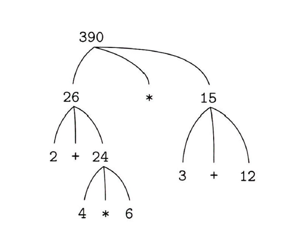

# 1장 함수를 이용한 추상화

- 계산적 과정은 컴퓨터 안에 사는 어떤 존재이다. 이것은 데이터라는 또 다른 존재를 조작한다. 과정이 패턴이 되면 프로그램이다.
- 프로그램을 작성하는 것은, 마법사가 주문을 외는 것과 비슷하다. 마법사의 제자처럼, 프로그래머는 자신의 과정이 어떤 일을 하는지 이해해야 한다.
- 잘 작성된 프로그램은 모듈화가 잘 되어있다.
- 이 책의 초점은 대규모 프로그램 설계이다.

---

- 자바스크립트는 자바스크립트 해석기(interpreter)를 사용해 프로그램을 수행한다.
- 자바스크립트는 스킴과 셀프의 핵심 기능을 상속한다.
- ECMAScript 2015는 아주 훌륭하다.

## 1.1 프로그래밍의 기본 요소

- 모든 강력한 언어는 다음 세 가지를 제공한다.
  - 원시 표현식(primitive expression) - 개체(entity). 원시 데이터(primitive data), 원시 함수(primitive function)
  - 조합 수단(combination) - 단순 → 복합
  - 추상화 수단(abstraction) - 복합 → 단순

### 1.1.1 표현식

- 표현식은 하나 이상의 원시 표현식(primitive expression)과 세미콜론(생략 가능)으로 구성된다.
- 조합(Combination)은 다른 표현식을 구성요소로 담는다.
- 연산자 +, -, \*, / 는 왼쪽 결합(left-associative)이다. 연산 순서는 연산자의 우선순위에 따라 결정한다.

```jsx
486;
2.7 + 10; // Operator combination
3 * 5 + (10 - 6); // Infix notation, nesting
```

### 1.1.2 이름 붙이기와 환경

- 상수는 해당 객체의 값(value)을 지칭한다. 가장 단순한 추상화 수당니다.

```jsx
const size = 2;
5 * size;
```

- 이름과 값을 연관시켜 값을 조회하려면 해석기는 메모리 공간이 필요하다. 이를 환경(environment, program environment)라 한다.

### 1.1.3 연산자 조합의 평가

- 연산자 조합을 평가하기 위해 다음을 수행한다.
  1. 조합의 피연산자 표현식 평가(재귀적)
  2. 연산자가 나타내는 함수를 인수들에 적용

```jsx
(2 + 4 * 6) * (3 + 12);
```

- 다음처럼 시각화할 수 있다.



- 단계 1을 거듭 적용하면 원시 표현식을 평가하는 지점에 도달한다.
  - 수치의 값, 이름의 값을 평가한다. 이때 환경에 대한 정보가 꼭 필요하다.

### 1.1.4 복합 함수

- 복합 연산에 이름을 붙여 하나의 단위로 지칭하는 함수 선언은 훨씬 강력한 추상화다.
- 제곱을 표현하는 다음 함수는 복합 함수(compound function)이다.

```jsx
function square(x) {
  return x * x;
}
```

- 이 함수는 함수 적용 표현식에서 사용한다. 함수 적용은 표현식으로 더 큰 표현식을 만드는 또 다른 조합이다.

```jsx
square(21);
```

- 함수 적용을 평가하려면 다음을 수행한다.
  1. 함수 표현식, 인수 표현식을 평가한다.
  2. 함수 표현식 값을 인수 표현식 값에 적용한다.

```jsx
square(2 + 5);
square(square(3));
```

- 함수를 다른 함수의 구축 요소(building block)로 사용한다.

```jsx
function sum_of_squares(x, y) {
  return square(x) + square(y);
}
function f(a) {
  return sum_of_squares(a + 1, a * 2);
}
```

### 1.1.5 함수 적용의 치환 모형

- 복합 함수를 인수들에 적용하기 위해서는 각 매개변수를 인수로 치환해 함수의 반환 표현식을 평가한다.
- 이것을 함수 적용의 치환 모형(substitution model)이라 한다.

```jsx
f(5);
sum_of_squares(5 + 1, 5 * 2);
square(6) + square(10)(6 * 6) + (10 + 10);
36 + 100;
136;
```

- 실제 해석기의 동작과는 거리가 있다.

**인수 우선 평가 대 정상 순서 평가**

- 인수의 값이 필요해질 때 까지 평가를 미룰 수 있다.
- 인수 표현식을 매개변수에 대입하고, 원시 함수와 연산자만 남으면 그때 인수 표현식을 평가한다.

```jsx
f(5);
sum_of_squares(5 + 1, 5 * 2);
square(5 + 1) + square(5 * 2)(5 + 1) * (5 + 1) + 5 * 2 * (5 * 2);

// 축약. reduction
6 * 6 + 10 * 10;
36 + 100;
136;
```

- 5 + 1, 5 \* 2가 각각 두번씩 평가된다.
- 완전히 전개 후 축약하는 평가 방법을 정상 순서 평가(normal-order evaluation, 표준 순서 평가)라 부른다.
- 먼저 인수를 평가 후 적용하는 것은 인수 우선 평가, 적용적 순서 평가(applicative-order evaluation)라 한다.
- 치환 모형으로 평가할 수 있고 적법한 값들을 산출하는 함수 적용의 경우 두 방법이 같은 값을 산출한다.
- 자바스크립트는 인수 우선 평가 방식을 사용한다.

### 1.1.6 조건부 표현식과 술어

- 사례 분석(case analysis)은 조건부 표현식(conditional expression)을 이용한다.

```jsx
function abs(x) {
  return x >= 0 ? x : -x;
}
```

- 형태는 다음과 같다.

```jsx
술어(predicate)
	? 귀결_표현식(consequent expression)
	: 대안_표현식(alternative expression)
```

- 해석기는 먼저 술어를 평가하고, 참이면 귀결 표현식을 평가해 그 값을 돌려준다. 거짓이면 대안 표현식을 평가해 그 값을 조건부표현식 전체의 값으로 돌려준다.
- 참 또는 거짓을 돌려주는 함수와 연산자도 술어라 부른다.

```jsx
p1
	? e1
	: p2
	? e2
...
	: pn
	? en
	: 최종_대안_표현식
```

- pi와 ei를 묶어 절(clause)라 부른다. 하나의 사례 분석 구조는 일련의 절들 끝에 하나의 최종 대안 표현식이 있는 형태이다.
- 복합 술어(compound predicate)를 구축하는 논리 조합 연산들도 있다. &&(논리곱, logical conjunction), ||(논리합, logical disjunction), !(논리부정, logical negation)
  - &&는 e1 ? e2 : false의 문법적 설탕.
  - ||는 e1 ? true : e2 의 문법적 설탕.
  - &&, ||의 우변항이 항상 평가되진 않는다.
- &&는 비교 연산자보다 우선순위가 낮으며, 조건부 표현식은 모든 연산자보다 낮다.

연습문제 1.1

연습문제 1.2

연습문제 1.3

연습문제 1.4

연습문제 1.5

### 1.1.7 예제: 뉴턴 방법으로 제곱근 구하기

- 컴퓨터 함수는 수학 함수와 다르게 반드시 효과적이어야 한다.
- “√x = y ≥ 0 이고 y^2 = x라는 조건을 충족하는 y”
  - 컴퓨터 함수를 서술하지는 않으며, 실제로 제곱근을 구하는 방법에 대해선 아무것도 말하지 않는다.
- 수학 함수와 컴퓨터 함수의 차이점은 사물의 성질을 서술하는 것과 뭔가를 하는 방법을 서술하는 것의 차이를 반영한다.
- 선언적 지식(declarative knowledge)와 명령적 지식(imperative knowledge)의 구분이라고도 말한다.
- 컴퓨터 과학에서는 주로 명령적 저술(어떻게)에 관심을 둔다.

---

- 뉴턴 방법으로 제곱근을 계산한다.
- 초기 추측값을 1로 시작해 근삿값을 거듭 개선해 나간다.

```jsx
function sqrt_iter(guess, x) {
  return is_good_enough(guess, x) ? guess : sqrt_iter(improve(guess, x), x);
}
function improve(guess, x) {
  return average(guess, x / guess);
}
function average(x, y) {
  return (x + y) / 2;
}
function is_good_enough(guess, x) {
  return abs(square(guess) - x) < 0.001;
}

// 최종 함수
function sqrt(x) {
  return sqrt_iter(1, x);
}
```

- 다음처럼 활용한다.

```jsx
sqrt(9);
sqrt(100 + 37);
sqrt(sqrt(2) + sqrt(3));
square(sqrt(1000));
```

연습문제 1.6

연습문제 1.7

연습문제 1.8

### 1.1.8 블랙박스 추상으로서의 함수

- 전체 sqrt 함수는여러 부분문제를 분해한 함수들의 군집(cluster)이다.
- 이때 필요한 분해 전략은 각 함수가 각자 식별 가능한 과제(task)를 수행하고 그것들을 모듈로 사용해 다른 함수 정의에 사용할 수 있게 하는 것이다.
- 특정 함수의 시점에서 다른 함수는 구체적 함수라기 보다는 추상이다. 이를 함수적 추상(functional abstraction)이라 한다.
- 함수는 세부 사항을 숨겨야 한다. 함수가 어떻게 구현되었는지 몰라도 블랙박스처럼 사용할 수 있어야 한다.

**지역 이름**

- 함수 매개변수 이름은 함수 본문 안에서만 유효한 지역 이름(local name)이어야 한다.
- 함수 is_good_enough의 x가 지역 이름이 아니라면 square의 x와 혼동할 수 있어 함수가 블랙박스가 아니게 된다.
- 반면 abs, square는 자유 이름이다. 자유 이름의 변화는 함수에 영향을 미친다.

```jsx
let x = 10;
function square() {
  return x * x;
}
function is_good_enough(guess) {
  return abs(square(guess) - x) < 0.001;
}
```

**내부 선언과 블록 구조**

- 개별적인 함수로 구성된 프로그램은 사용자에게 혼란을 줄 수 있다. 특히 대형 시스템에서는 이 문제가 심각해진다.

```jsx
function sqrt(x) {
  return sqrt_iter(1, x);
}
// 밑의 함수들은 노출되면 안된다.
function sqrt_iter(guess, x) {
  return is_good_enough(guess, x) ? guess : sqrt_iter(improve(guess, x), x);
}
function is_good_enough(guess, x) {
  return abs(square(guess) - x) < 0.001;
}
function improve(guess, x) {
  return average(guess, x / guess);
}
```

- 이때는 필요한 함수를 함수 내부 블록에 넣어 선언할 수 있다.
- 이를 블록 구조라고 한다.

```jsx
function sqrt(x) {
  function sqrt_iter(guess, x) {
    return is_good_enough(guess, x) ? guess : sqrt_iter(improve(guess, x), x);
  }
  function is_good_enough(guess, x) {
    return abs(square(guess) - x) < 0.001;
  }
  function improve(guess, x) {
    return average(guess, x / guess);
  }
  return sqrt_iter(1, x);
}
```

- 이때 x는 sqrt에 바인딩 되므로 이런 어휘순 범위 적용(lexical scoping)을 이용해 sqrt내에서 x를 자유 이름으로 활용할 수 있다.

```jsx
function sqrt(x) {
  function is_good_enough(guess) {
    return abs(square(guess) - x) < 0.001;
  }
  function improve(guess) {
    return average(guess, x / guess);
  }
  function sqrt_iter(guess) {
    return is_good_enough(guess) ? guess : sqrt_iter(improve(guess));
  }
  return sqrt_iter(1);
}
```
